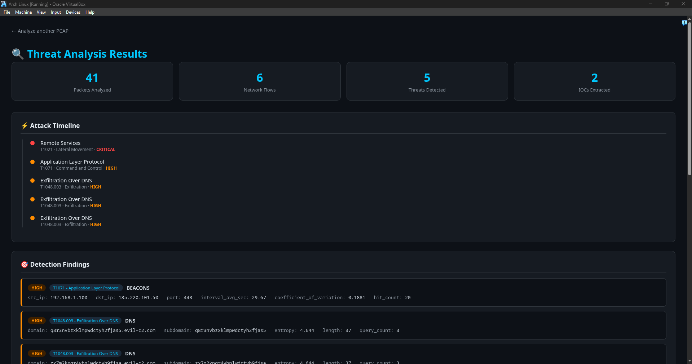
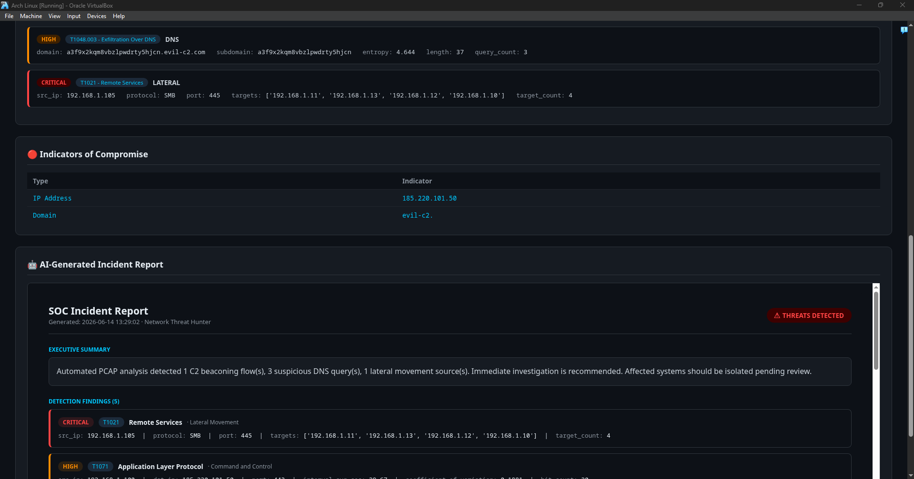
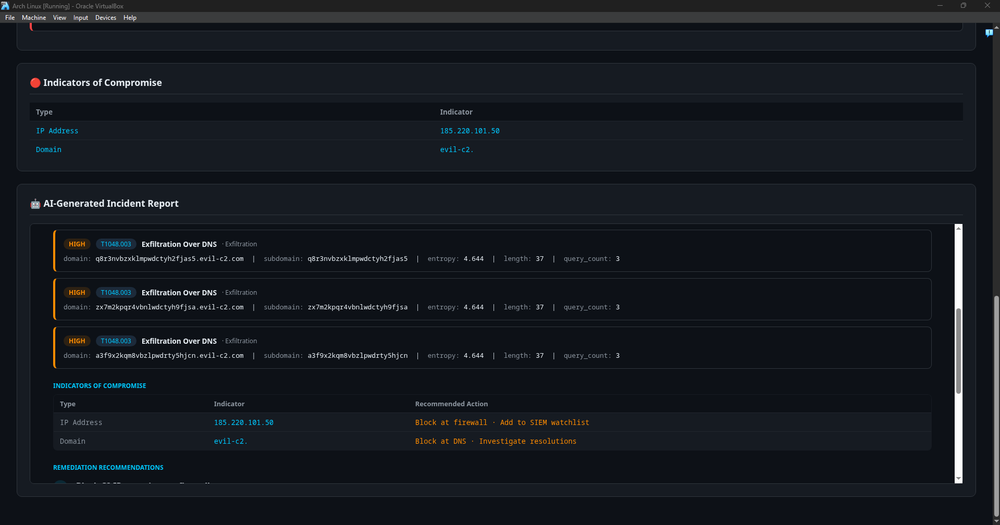
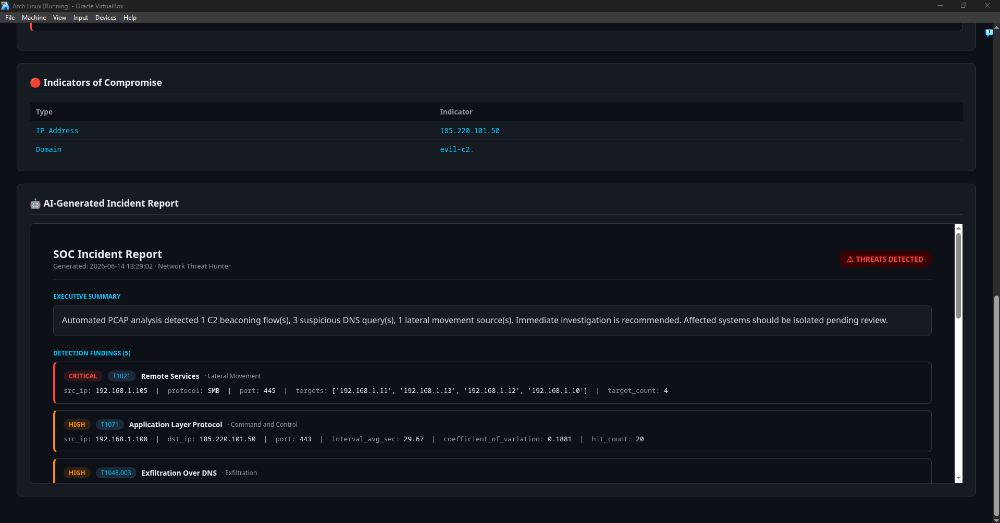
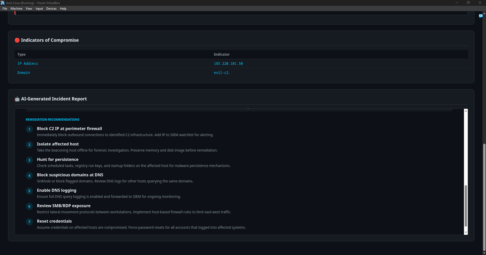

# 🔍 Network Detection & Threat Hunting Platform

A web-based PCAP analysis platform that automatically detects malicious network traffic and generates structured SOC incident reports mapped to MITRE ATT&CK.

Built as a portfolio project to fill a specific gap: proving hands-on network telemetry and packet-level investigation skills alongside existing detection engineering and cloud security work.



---

## 🎯 Why I Built This

After reviewing my portfolio, I identified a clear blind spot: while I had strong coverage in host-based detection (Wazuh, Splunk, Sysmon), cloud attack simulation (AWS/Azure), and adversary emulation, I had **zero projects demonstrating network-level threat detection**.

A hiring manager reviewing my resume would ask: *"This candidate is strong in ATT&CK mapping and SIEM — but can they work with raw network telemetry?"*

This project directly answers that question.

---

## 🚀 What It Does

Upload any PCAP file and the platform automatically runs 4 detection modules in parallel:

```
PCAP Upload
    ↓
Packet Parsing (Scapy)
    ↓
┌─────────────────────────────────────────┐
│  Beacon Detector  │  DNS Analyzer       │
│  HTTP Analyzer    │  Lateral Movement   │
└─────────────────────────────────────────┘
    ↓
MITRE ATT&CK Mapping + IOC Extraction
    ↓
Attack Timeline Dashboard + SOC Report
```

---

## 🔬 Detection Modules

| Module | Technique | MITRE ID | Tactic | How It Works |
|--------|-----------|----------|--------|--------------|
| Beacon Detector | C2 Beaconing | T1071 | Command and Control | Calculates coefficient of variation across flow intervals — low variance = regular beaconing |
| DNS Analyzer | DNS Tunneling | T1048.003 | Exfiltration | Shannon entropy scoring on subdomains + query length analysis |
| HTTP Analyzer | Web Protocol Abuse | T1071.001 | Command and Control | Flags suspicious user-agents, oversized POSTs, abnormally long URIs |
| Lateral Movement | Remote Services | T1021 | Lateral Movement | Detects single source connecting to multiple internal hosts on SMB/RDP/WinRM |




---

## 🧱 Tech Stack

- **Python + Scapy** — packet ingestion, flow reconstruction, protocol dissection
- **Flask** — web application, file upload handling, result rendering
- **NumPy** — statistical analysis for beacon interval detection
- **Jinja2** — templated dashboard and report rendering
- **MITRE ATT&CK** — technique mapping across all detection modules

---

## ⚔️ Engineering Challenges & How I Solved Them

This section documents the real problems encountered during the build — not the happy path.

---

### Challenge 1: PyShark Broken on Python 3.14

**Problem:** PyShark 0.6 uses `asyncio.set_child_watcher()` and `asyncio.get_event_loop()`, both removed in Python 3.14. The library threw `AttributeError` on import and was completely unusable.

**What I tried first:** Patching the event loop at import time with `asyncio.set_event_loop(asyncio.new_event_loop())`. This fixed the first error but exposed a deeper one — `asyncio.SafeChildWatcher` was also removed in 3.14.

**Solution:** Dropped PyShark entirely and rewrote the parser using **Scapy's `rdpcap()`** instead. Scapy has no asyncio dependency, handles the same protocols, and gave more direct control over packet fields. The switch actually simplified the codebase.

**Lesson:** When a dependency is fundamentally broken on your runtime version, replacing it is faster than patching it.

---

### Challenge 2: tshark Capture Permission Denied

**Problem:** `sudo tshark -i any -w uploads/test.pcap` failed with `Permission denied` because tshark runs as root but the uploads folder was owned by the user.

**What I tried first:** `sudo chown` on the uploads folder — didn't help because the process still ran as root and wrote to a path it couldn't access.

**Solution:** Captured to `/tmp/` (always writable by root), then moved and re-chowned the file:
```bash
sudo tshark -i enp0s3 -a duration:10 -w /tmp/test.pcap
sudo mv /tmp/test.pcap uploads/test.pcap
sudo chown user:user uploads/test.pcap
```

**Lesson:** When privilege escalation causes file permission conflicts, write to a neutral location first.

---

### Challenge 3: Interface Name Mismatch

**Problem:** `sudo tshark -i eth0` failed with `No such device`. Modern Linux uses predictable interface naming — `eth0` doesn't exist on this system.

**Solution:** Used `ip link show` to enumerate actual interfaces, identified `enp0s3` as the active one, and used that instead.

**Lesson:** Never assume interface names. Always enumerate with `ip link show` before capturing.

---

### Challenge 4: Indentation Errors from nano

**Problem:** Editing Python files in nano caused repeated `TabError` and `IndentationError` crashes because nano mixed tabs and spaces depending on how code was pasted.

**Solution:** Stopped using nano for multi-line code blocks and switched to heredoc `cat >` writes from the terminal:
```bash
cat > modules/file.py << 'EOF'
# code here — guaranteed consistent indentation
EOF
```

**Lesson:** For security projects on a terminal-only workflow, heredoc writes are more reliable than interactive editors for code blocks.

---

### Challenge 5: API Key Leaked to GitHub

**Problem:** The `.env` file containing the Anthropic API key was committed before `.gitignore` was properly set up. GitHub's push protection blocked the push and flagged the secret.

**What I did:**
1. Immediately rotated the API key at `console.anthropic.com`
2. Used `git filter-branch` to rewrite history and remove `.env` from all commits
3. Force-pushed the cleaned history
4. Verified `.env` was in `.gitignore` before any further pushes

**Lesson:** Add `.gitignore` before the first commit, not after. Secrets in git history require full history rewriting — not just deleting the file.

---

### Challenge 6: AI Report Rendering Blank

**Problem:** The Claude API was returning 4,985 characters of valid HTML but the report box rendered completely empty in the browser.

**Debugging process:**
1. Added `print(f"DEBUG report length: {len(report_html)}")` to the Flask route — confirmed the report was being generated
2. Tested the report generator directly in Python — confirmed the API returned valid HTML
3. Identified root cause: the report HTML contained a full `<body>` tag with conflicting styles that collapsed the container div

**Solution:** Switched to a **template-based report generator** that builds the HTML directly from findings data — no external API dependency, always renders correctly, works offline.

**Lesson:** When debugging a rendering issue, isolate each layer (API → Flask → template) independently before assuming the problem is in the frontend.

---

## 📊 Sample Output




---

## ⚡ Quick Start

```bash
git clone https://github.com/cpt-ferna02/network-threat-hunter.git
cd network-threat-hunter
python3 -m venv venv && source venv/bin/activate
pip install -r requirements.txt
python3 app.py
```

Open `http://localhost:5000` and upload a PCAP.

> **Note:** Requires tshark/Wireshark installed for full functionality.
> Arch/BlackArch: `sudo pacman -S wireshark-cli`
> Ubuntu/Debian: `sudo apt install tshark`

---

## 🧪 Generating Test Traffic

No malicious PCAP? Generate synthetic attack traffic locally:

```bash
python3 uploads/generate_full.py
```

This creates a PCAP simulating:
- **C2 beaconing** — 20 packets to a fake C2 IP at ~30 second intervals (T1071)
- **DNS tunneling** — 3 high-entropy subdomain queries (T1048.003)
- **SMB lateral movement** — 1 source connecting to 4 internal hosts on port 445 (T1021)

Upload the generated `uploads/full_attack.pcap` to see all detectors fire simultaneously.

---

## 📁 Project Structure

```
network-threat-hunter/
├── app.py                    # Flask entry point + pipeline orchestration
├── requirements.txt
├── modules/
│   ├── pcap_parser.py        # Scapy packet ingestion + flow reconstruction
│   ├── beacon_detector.py    # C2 beaconing via coefficient of variation
│   ├── dns_analyzer.py       # DNS tunneling via Shannon entropy
│   ├── http_analyzer.py      # Suspicious HTTP pattern detection
│   ├── lateral_movement.py   # SMB/RDP/WinRM fan-out detection
│   ├── ioc_extractor.py      # IP and domain IOC extraction
│   ├── attack_mapper.py      # MITRE ATT&CK mapping + timeline builder
│   └── report_generator.py   # Structured SOC incident report
└── templates/
    ├── index.html             # Drag-and-drop PCAP upload UI
    └── results.html           # Attack timeline dashboard
```

---

## 👤 Author

**Fernando Cortez Jr.**
Penetration Tester | Detection Engineer
[github.com/cpt-ferna02](https://github.com/cpt-ferna02) · [linkedin.com/in/fernando-cortezjr-a3529a313](https://linkedin.com/in/fernando-cortezjr-a3529a313)
